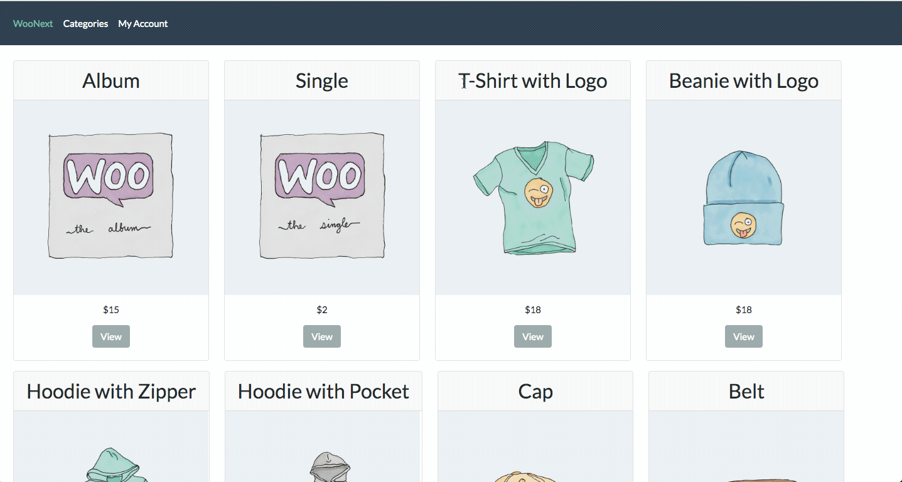

# Woo Next React Theme :rocket:
> * This is a React WooCommerce theme, built with Next JS, Webpack, Babel, Node, Express, using WooCommerce REST API.

## Demo :video_camera:



# Features:

1. WooCommerce Store in React
2. SSR
3. SEO friendly
4. Automatic Code Splitting
5. Hot Reloading
6. Prefetching
7. GraphQl with Apollo

## Getting Started :rocket:

These instructions will get you a copy of the project up and running on your local machine for development purposes.

### Prerequisites :page_facing_up:


### Installing :wrench:

1. Clone this repo in `git clone git@github.com:imranhsayed/woo-next`
2. `cd woo-next`
3. `npm install`

## Add GraphQl support for WordPress

1. Clone and activate the following plugins , in your WordPress plugin directory:

* a. [wp-graphql](https://github.com/wp-graphql/wp-graphql) Exposes graphql for WordPress.
* b. [wp-graphiql](https://github.com/wp-graphql/wp-graphiql) Provides GraphiQL IDE (playground) to the WP-Admin.
* c. [wp-graphql-woocommerce](https://github.com/wp-graphql/wp-graphql-woocommerce) Adds Woocommerce functionality to a WPGraphQL schema.

You can also import default wooCommerce products that come with wooCommerce Plugin for development ( if you don't have any products in your WordPress install ) `WP Dashboard > Tools > Import > WooCommerce products(CSV)`: The WooCommerce default products csv file is available at `wp-content/plugins/woocommerce/sample-data/sample_products.csv`

## Configuration :wrench:

* Rename `client-config-example.js` to `client-config.js` and update your React Site URL

```ruby
const clientConfig = {
	siteUrl: 'http://xyz.com',
    graphqlUrl: 'http://wordpressSiteUrl.com/graphql
};

export default clientConfig;
```

## Common Commands :computer:

* `dev` Runs server in development mode

## Contributing :busts_in_silhouette:

Please read [CONTRIBUTING.md](https://gist.github.com/PurpleBooth/b24679402957c63ec426) for details on our code of conduct, and the process for submitting pull requests to us.

## Versioning :bookmark_tabs:

I use [Git](https://github.com/) for versioning. 

## Author :bust_in_silhouette:

* **[Imran Sayed](https://twitter.com/imranhsayed)**

## License :page_with_curl:

This project is licensed under the MIT License - see the [LICENSE.md](LICENSE.md) file for details
